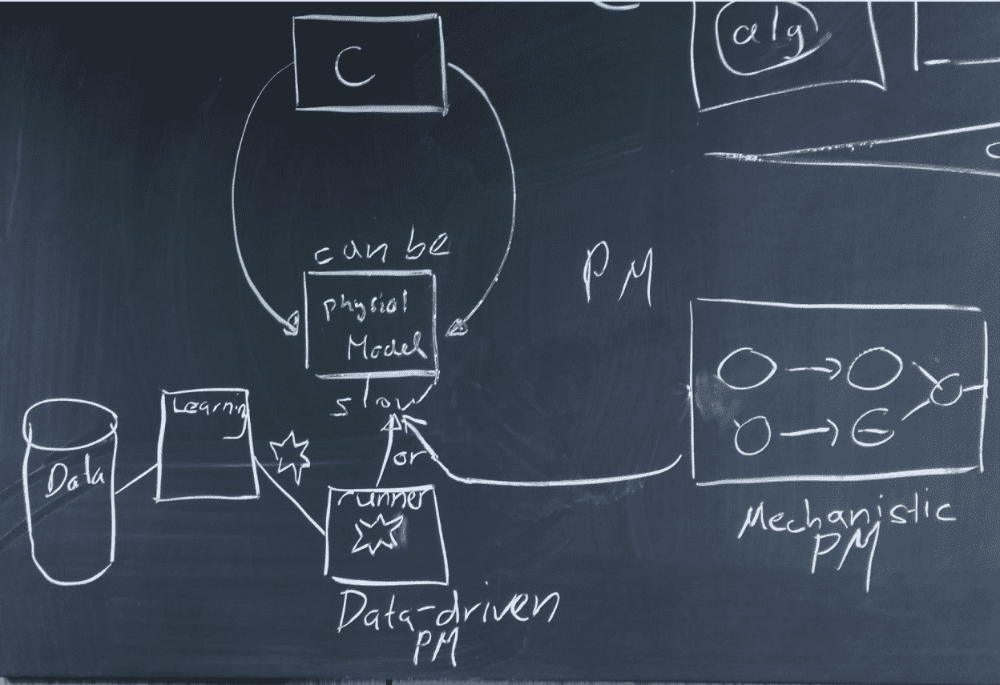
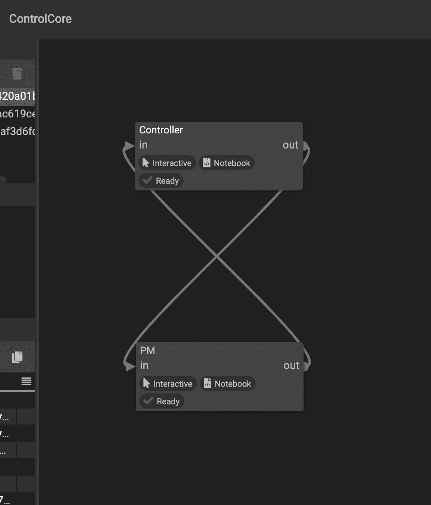
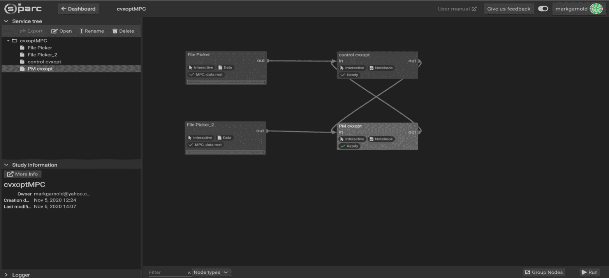
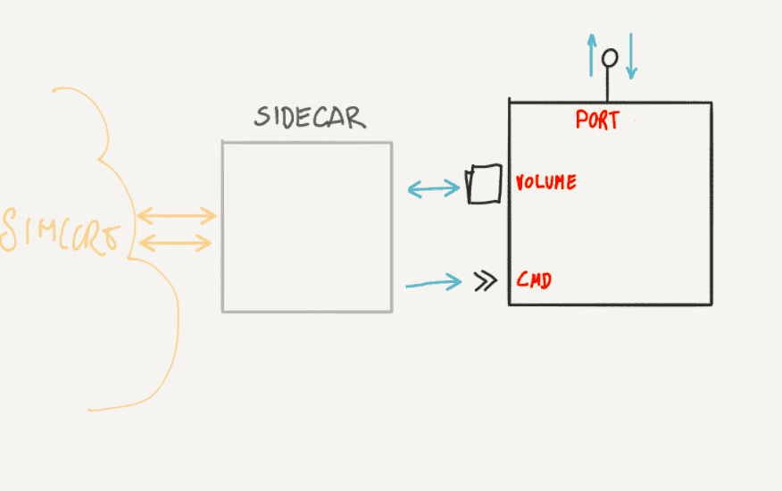

 # Control Core

 

---

 ## Use case: *control* loop with two nodes
 
 Created two interacting nodes (I renamed them "*control*" and "*PM*")

### draft 1
 They each do a silly computation:

 1. *control* increments the output of *PM* (``y``) by one and this result (``x``) is the input to *PM* 
 2. *PM* increments its input (``x``) by ``0.5`` and this result is the input to *control*.
 3. To keep it from being an infinite loop, they both terminate when ``x>10``, and reset their values back to ``0`` (so I can rerun the notebook easily).

When I first start one node, it is just stuck at ``0``, but when I start the other node, they progress such that ``x`` is always one larger than ``y``

### draft 2

- As draft 1 but one dedicated time heartbeat + array of weights for optimization for inputs/outputs

### draft 3

- Untested idea:  Sleeping with standard I/O in Jupyter Lab?

----

## Integration in osparc

Currently this is how it looks and works using notebooks

 

 
### Interfaces to container

